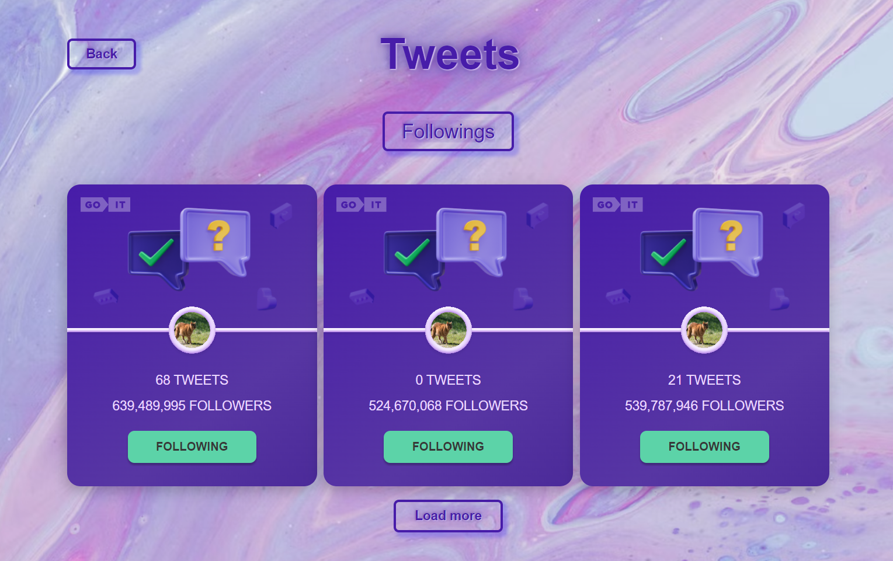

Welcome to the TWEETS APP!

This is a small application, which i did as a tech test during my studying.

It was written using React with Redux Toolkit and styled with module.css.

This app consists of 2 pages - Home and Tweets.

In this app you can follow some users and your followings will save if you
reload the page.

Also here you can do a filtration of users - all, follow, followings.

Done by Anna Zubakha, 2024.

